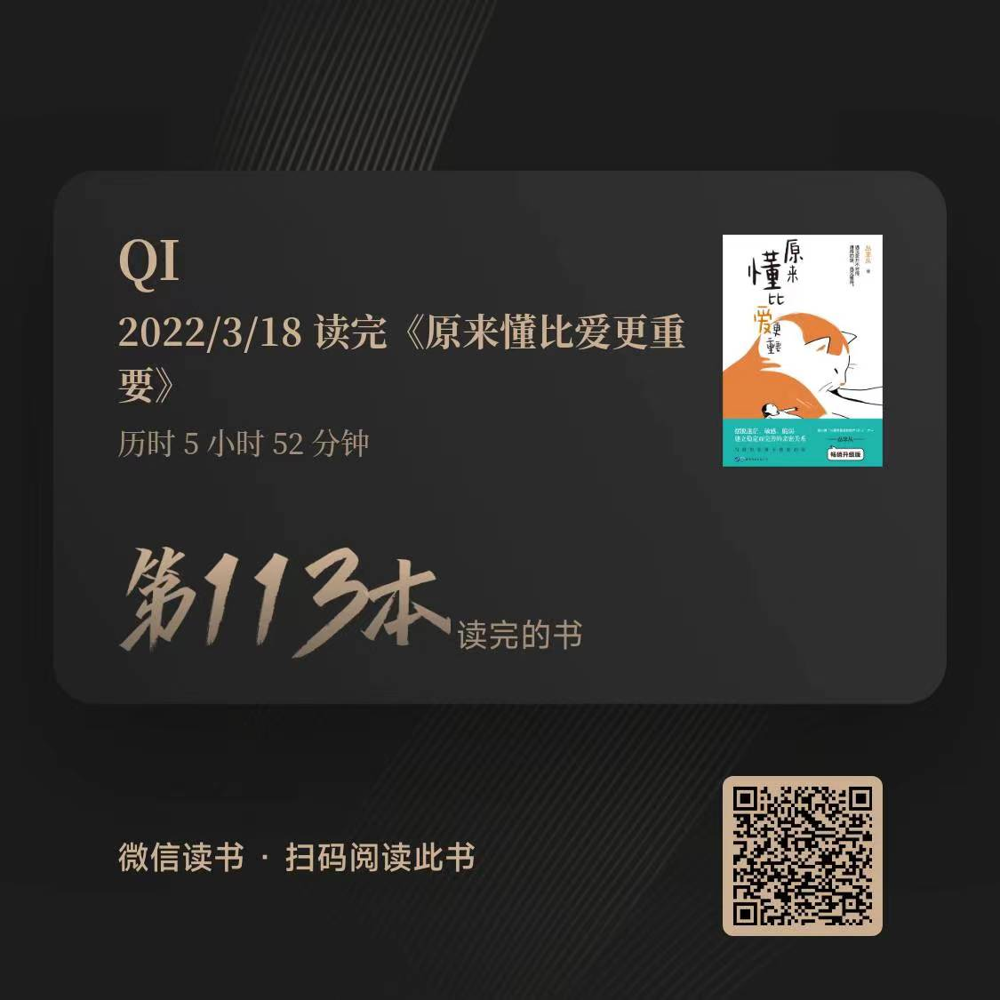

# 《原来，懂比爱更重要》

## 内容简介

[《原来，懂比爱更重要》](https://book.douban.com/subject/35638240/)

人存在于世上，有三种关系：和自己的关系、和他人的关系与和情境的关系。世间的痛苦，都与关系中爱和爱的缺失有关。而爱不能流动，都与不能懂得有关。所有的关于情绪化、拖延、迷茫、无助、敏感、否定、看不惯、防御心、指责、直言直语、虚伪、争吵、恋爱困难、感情失谐、绝望，都是因为不懂得。我们不懂自己，所以痛苦却难以改变。我们不懂他人，所以想爱却孤独无力。

如果说什么有可以让我们走向快乐幸福，那就是懂得。懂得他人，得以和谐关系。懂得自己，得以充满力量。

本书通过对事物、情感进行专业、深入的剖析，深入简出地使读者明白：改变，从懂自己、懂他人开始。有了懂得，爱就能在我们身边流动起来、传递下去。

