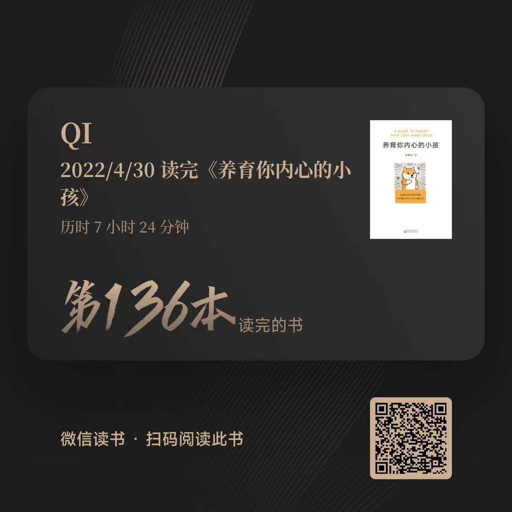

# 《养育你内心的小孩》

## 内容简介

[《养育你内心的小孩》](https://book.douban.com/subject/35713938/) 是一本通俗易懂的讲述如何与自己相处的心理学著作。

国家二级心理咨询师丛非从，用十年的线下咨询和教学心得，从安全感、自由感、价值感、意义感、亲密感五个角度切入，36篇文章由点到线、由线到面，层层推进，娓娓道来，用风趣幽默的语言、犀利直接的观察，一举击碎生活中反复出现的负面情绪，直指情感关系中常见的疑难杂症，带领你直探内心需要，从根本解决问题。

如果你有一个孤独的内在，你就会发现那里有一个无助的自己，不知道该怎么独自生活。

做内心强大的自己并不是硬撑，硬撑是很孤独的，是一出假装强大的独角戏。

当你真正倾听自己、从自己内心的角度思考问题，你就走上了独立、强大、自主之路。

这个世界会扔给你各种问题，你缺少的从来不是方法，而是底气。

本书以配有大量的真实咨询案例，如同面对私人心理咨询师，帮你看到躲藏在内心深处的自己：不相信自己值得被爱，不相信自己已经做得足够好，不相信自己的痛苦可以轻易消散……

我们只能通过内心感受来理解自己，同样的，只有内心感受是专属于我们个人的经历。感受到痛苦意味着变好的可能，只要你愿意面对真实的自己。总是喜欢挑毛病，总是躲避亲密关系，总是觉得很愤怒……

一切负面情绪，只是在提醒你，内心的需要还没有被满足。与其学习很多技巧，不如从翻开这本书开始，陪自己内心的小孩长大。

## 作者简介

[丛非从](https://weibo.com/congnotcong?sudaref=www.baidu.com&is_hot=1)  主要从事萨提亚模式、精神分析、认知行为培训。长期在北京、上海、深圳等城市开设“自我成长工作坊”“OH卡探索潜意识工作坊”等课程，深度疗愈上万人。

应用心理学硕士，国家二级心理咨询师，拥有十年的心理咨询经验。已出版《原来，懂比爱更重要》《自我成长的力量》《理解愤怒》等多部作品。

## 理解感悟

“内心住着小孩” 是大多数人的常态，但是我们容易忽略小孩的诉求，再被放大传导，形成我们成长的困惑，如果，我们能早点窥探到内心的密码，是否就没有那么的烦恼和遗憾，这可能就是我们一直在寻找的不完整的自己。

