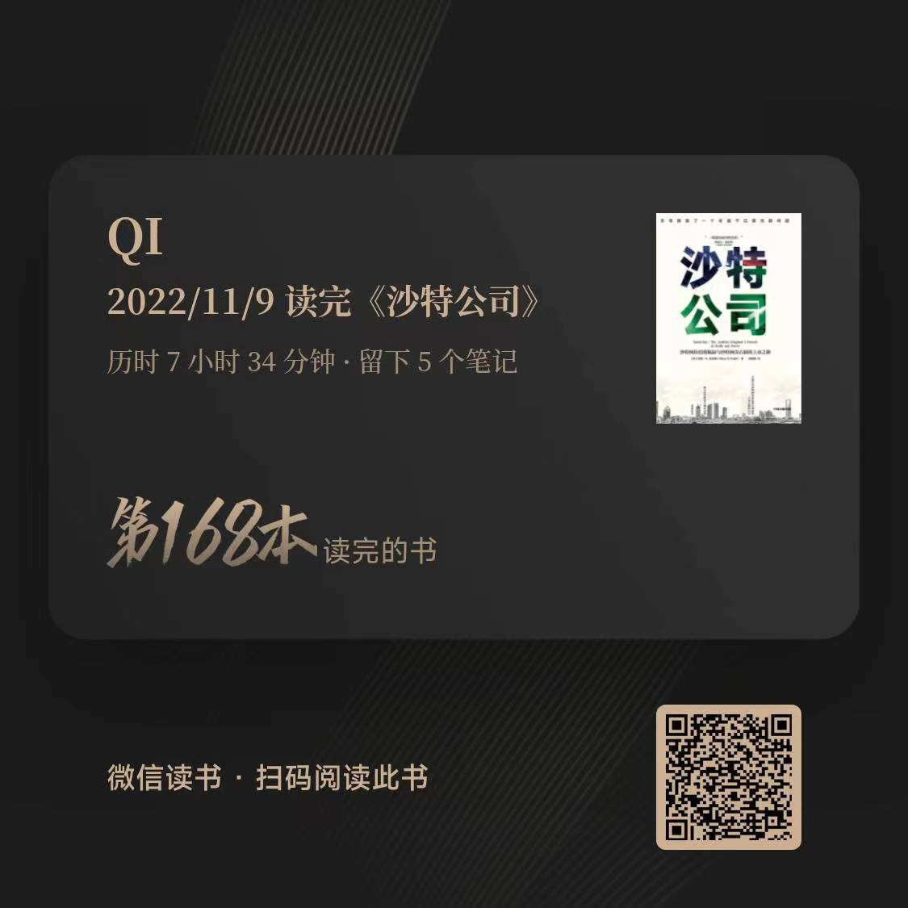

# 《沙特公司》

## 内容简介

沙特国家石油公司（ARAMCO， 简称沙特阿美）是沙特最大的石油公司，国有企业。公司前世今生沙特阿美最初是1933年，沙特和美国雪弗龙石油公司的前身，加利福尼亚标准石油公司（SOC）签署合作勘探和开采石油协议，为此成立沙特阿美。1973 - 1980年间，沙特阿美买下美方股权，公司为沙特王室全资拥有。沙特石油储量世界第二，仅次于委内瑞拉；产量世界第二，仅次于美国。但沙特阿美具有无与伦比的优势：全国油田都属于它；跟世界其他许多地方相比，沙特的油田更容易开采，成本更低。据估算，沙特的原油开采成本可低于每桶10美元，而英国北海布伦特原油开采成本是60美元。沙特阿拉伯是世界头号石油出口国，也是主要产油国中唯一一个保证每天至少有200桶剩余产能，一旦需要可以立刻投入使用。

1971年，美国总统尼克松宣布放弃金本位，布雷顿森林体系崩溃，美国不得不为美元找到新的锚——石油。美国与欧佩克达成协议，欧佩克石油交易以美元结算，此举有助于美元币值的稳定，但美元也容易受制于石油。1973年，OPEC会议在奥地利维也纳的常设总部举行。石油公司的代表包括壳牌石油的安德烈·贝纳德、埃克森石油的乔治·皮尔西等。会议围绕着新的原油牌价进行。谈判一开始，贝纳德和皮尔西就提议将原油牌价提高15%（每桶价格上涨45美分）。但是沙特方面回答说，OPEC希望的是提高100%（每桶价格上涨约3美元）。在谈判无果的情况下，OPEC单方面将原油价格提高70%。除了提价外，欧佩克宣布石油减产，每月减产5%，并对美国及其盟友实施石油禁运。

这轮大幅提价引爆了第一次石油危机。美国经济陷入滞胀，高通胀、高失业以及经济衰退。这场危机一直延续到1982年，是美国自大萧条以来最严重、持续时间最长的一次经济衰退。此时沙特提出，希望将阿美石油公司变为一家纯粹的沙特公司。此时的美国政府正被滞胀危机搞得焦头烂额，不希望OPEC再次提价。双方很快就达成了协议。1980年3月9日，沙特政府完成了对阿美石油公司的收购，这家公司成为沙特的拥有者——沙特国王的财产。不过后来的事实也证明，公司所有权归属与公司的运营无关，阿美几乎继承了原董事会在内的所有制度，阿美石油公司拥有近乎完整的自主运营权。1988年，沙特阿拉伯国家石油公司成立，接管原阿美石油的所有资产及经营权。从此，阿美石油被称为沙特阿美，但它依然是一家美式管理方式的国际石油公司。

## 作者简介

[Ellen R.Wald](http://www.ellenrwald.com/) 地缘政治学和全球能源产业专家顾问，波士顿大学历史学博士。

## 读后笔记

沙特至今依然是世界最为神秘的国家之一。这片土地上交织着美国人与阿拉伯世界、世俗社会与伊斯兰教、君主制与民主制的矛盾，还有国家之间对于石油的博弈。通过这本《沙特公司》，我们可以回顾沙特崛起的历史，了解沙特阿美石油公司在这段历史中的变迁：1932年，科威特流亡者阿卜杜勒·阿齐兹控制阿拉伯半岛后宣布建国。他用自己家族的名称给这个国家命名为——沙特阿拉伯。1932年利雅得的人口数量不到4万，然而到21世纪初，则已增长至600万，拥有繁忙的交通、高档的商业街，以及按照财富等级与阶层划分的居民区。1932年，这位统治者名下几乎没有钱。但是阿齐兹国王的儿子们，也就是阿拉伯王国后继的统治者们，将会坐享巨额财富，并拥有全世界最赚钱的公司——沙特阿美石油公司

在众多石油大国中，沙特阿拉伯一枝独秀的富有，在20世纪30年代，美国石油商人到了时沙特阿拉伯仍然保持着几百年来的固有的状态，然而，沙特人正确的利用“上帝赐予的礼物”将沙特王国逐渐转变为世界强国。而这这个百年变革的关键就是沙特阿美石油公司。

一个多世纪以来，沙特家族通过精心制定的策略和有预见性的合作，持续追逐着利益与权力，从沙特王室卑微的开端和美国人从8000英里之外冒险提议的第一项石油企业计划开始，到今天沙特王国和沙特阿美石油公司面临全新的变革。《沙特公司》揭示了沙特王室权力交替、20世纪70年代石油危机、石油输出国组织的深谋远虑，以及沙特阿美石油公司全球扩张等重要历史事件背后未曾公开的细节，这是一部真实的上层建筑博弈历史传记，如果能跟上其中格局和逻辑，就具备看懂天下大势的能力。

